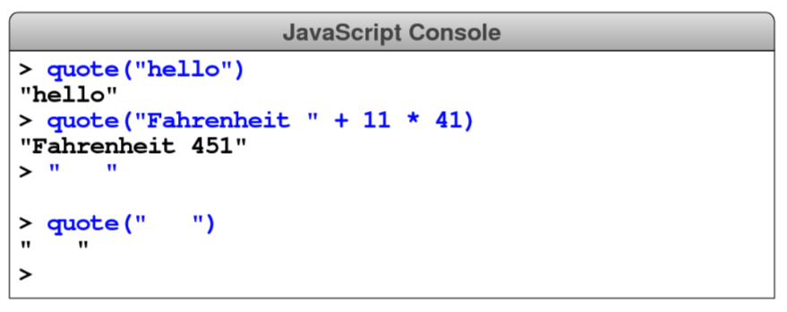

# CHALLENGE 4

Write a function `quote` that takes a string value and adds double quotation marks at both the beginning and the end. Your function definition should allow you to replicate the following console session:

As the lines at the end of this example indicate, the `quote` function can make it easier to see where a string begins and ends, particularly if the string contains spaces.
